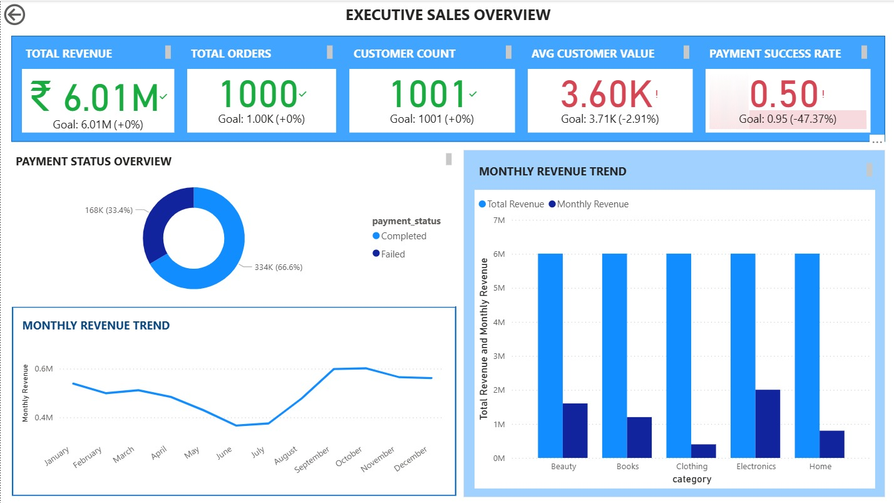
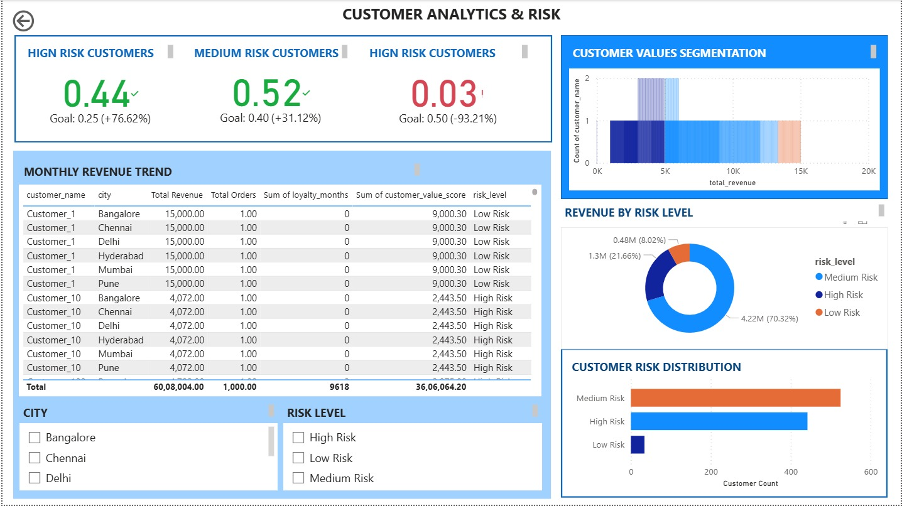
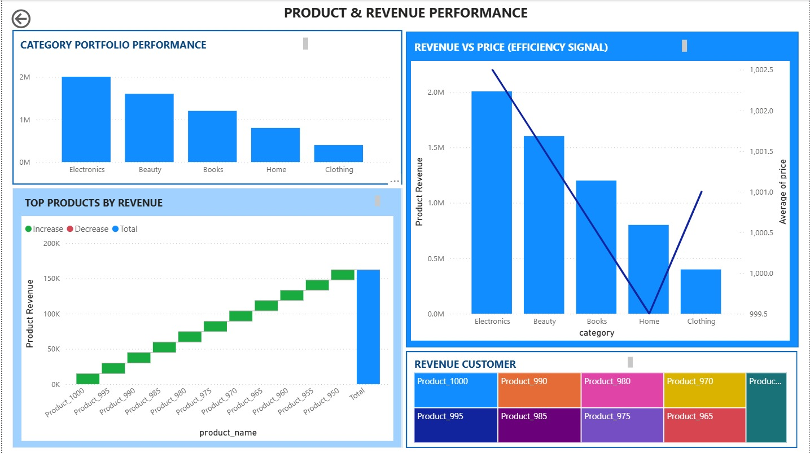
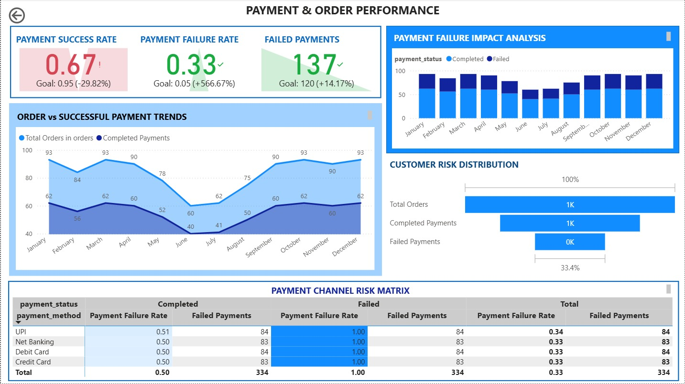
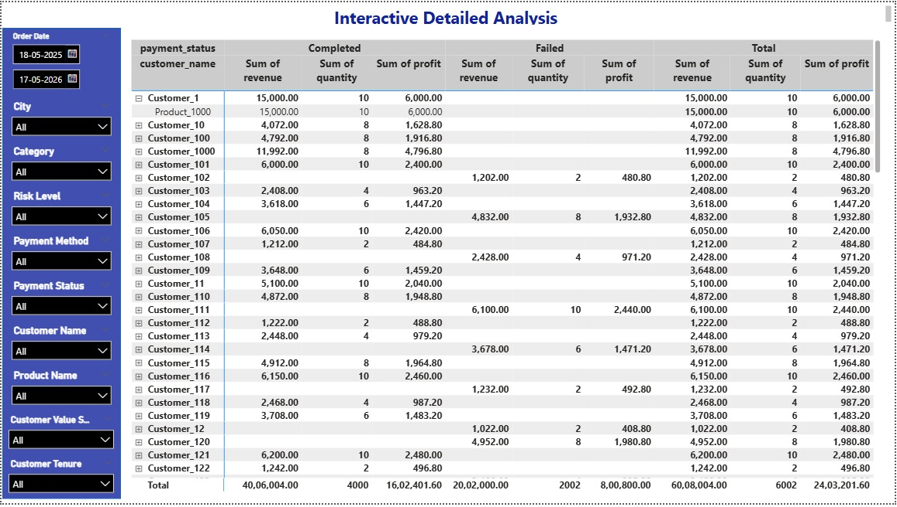

# End-to-End Sales & Customer Analytics Platform

## Project Overview

This project is a complete end-to-end analytics engineering and business intelligence solution designed to transform raw transactional sales data into actionable business insights.

The platform integrates **MySQL, Python ETL, feature engineering, customer risk scoring, SQL analytical modeling, and Power BI interactive dashboards** to deliver a scalable analytics workflow.

This project demonstrates practical skills across:

- Data Engineering
- Analytics Engineering
- Business Intelligence
- SQL Data Modeling
- Python ETL Development
- Dashboard Development
- Customer Analytics
- Risk Segmentation

---

## Business Problem

Organizations generate large volumes of transactional sales, customer, product, and payment data but often lack a structured analytics pipeline to convert raw operational data into strategic business insights.

Challenges addressed:

- Fragmented raw sales data
- Lack of customer risk segmentation
- Limited visibility into payment failures
- Difficulty tracking revenue performance
- No centralized business intelligence dashboard
- Manual analysis inefficiencies

---

## Solution Architecture

Raw relational sales data is processed through a Python ETL pipeline, enriched with engineered customer metrics, scored using business-driven risk logic, transformed into SQL analytical views, and visualized through interactive Power BI dashboards.

Flow:

MySQL Database  
→ Python ETL Pipeline  
→ Feature Engineering  
→ Customer Risk Scoring  
→ SQL Analytical Views  
→ Power BI Dashboards

---

## Technology Stack

### Database
- MySQL

### Backend / ETL
- Python
- Pandas
- SQLAlchemy
- PyMySQL
- python-dotenv

### Analytics Engineering
- SQL Views
- Feature Engineering
- Business Rule Risk Scoring

### Business Intelligence
- Power BI
- DAX Measures
- Interactive Slicers
- Matrix Reports
- KPI Cards
- Drill-through Analytics

### Development Tools
- Visual Studio Code
- Git
- GitHub
- ODBC Connectivity

---

## Database Schema

Core entities:

- Customers
- Products
- Orders
- Order Items
- Payments

Analytical views:

- `customer_value_sql`
- `vw_customer_risk`
- `vw_sales_detailed`

---

## Python ETL Workflow

### 1. Data Extraction
Extracts data from MySQL:

- customer data
- order data
- product pricing
- transactional details

Files:
```bash
python/data_extraction.py
```

---

### 2. Feature Engineering
Derived metrics:

- Total Revenue
- Total Orders
- Loyalty Months
- Customer Value Score

Formula:

```python
customer_value_score =
(total_revenue * 0.6) +
(total_orders * 0.3) +
(loyalty_months * 0.1)
```

File:
```bash
python/feature_engineering.py
```

---

### 3. Risk Scoring Logic

Business rule segmentation:

```python
score >= 8000      → Low Risk
score >= 3000      → Medium Risk
score < 3000       → High Risk
```

File:
```bash
python/revenue_risk_model.py
```

---

### 4. Export to MySQL
Engineered analytics dataset exported back into MySQL:

```bash
customer_value_python
```

File:
```bash
python/export_to_mysql.py
```

---

## Power BI Dashboards

### Executive Sales Overview
Insights:
- Total Revenue
- Total Orders
- Customer Count
- Average Customer Value
- Payment Success Rate
- Monthly Revenue Trends



---

### Customer Analytics & Risk Dashboard
Insights:
- High / Medium / Low Risk Segmentation
- Customer Revenue Analysis
- Customer Distribution by Risk
- Customer Value Distribution
- Geographic Filtering



---

### Product & Revenue Performance
Insights:
- Category Revenue Performance
- Product Revenue Contribution
- Revenue vs Price Analysis
- Top Performing Products



---

### Payment & Order Performance
Insights:
- Payment Success Rate
- Failure Analysis
- Payment Method Risk Analysis
- Order vs Successful Payment Trends



---

### Detailed Analysis Dashboard
Interactive filtering using:

- Order Date
- City
- Category
- Risk Level
- Payment Method
- Payment Status
- Customer Name
- Product Name
- Customer Value Score
- Loyalty Months

Detailed drillable matrix reporting for granular investigation.



---

## Project Structure

```bash
end-to-end-sales-customer-analytics-platform/
│
├── python/
│   ├── data_extraction.py
│   ├── db_connection.py
│   ├── export_to_mysql.py
│   ├── feature_engineering.py
│   ├── main.py
│   ├── revenue_risk_model.py
│   └── test_connection.py
│
├── sql/
│   ├── database_setup.sql
│   └── analytics_view.sql
│
├── powerbi/
│   └── Sales_&_Customer_Revenue_Analytics_Dashboard.pbix
│
├── screenshots/
│   ├── executive-overview.jpeg
│   ├── customer-risk-analysis.jpeg
│   ├── product-performance.jpeg
│   ├── payment-order-analysis.jpeg
│   └── detailed-analysis.jpeg
│
├── .env.example
├── .gitignore
├── requirements.txt
└── README.md
```

---

## Setup Instructions

### Clone repository

```bash
git clone https://github.com/YuvasriSundarrajan/end-to-end-sales-customer-analytics-platform.git
```

---

### Install dependencies

```bash
pip install -r requirements.txt
```

---

### Configure environment variable

Create `.env`

```env
MYSQL_PASSWORD=your_password
```

---

### Run ETL pipeline

```bash
python python/main.py
```

---

### Open Power BI dashboard

Open:

```bash
powerbi/Sales_&_Customer_Revenue_Analytics_Dashboard.pbix
```

---

## Key Skills Demonstrated

- SQL Data Modeling
- Relational Database Design
- Python ETL Pipeline Development
- Feature Engineering
- Business Rule Analytics
- Risk Segmentation
- SQL View Engineering
- Power BI Dashboard Development
- DAX Analytics
- Interactive Business Intelligence
- Git Version Control
- GitHub Project Publishing

---

## Resume Project Description

Built an end-to-end sales and customer analytics platform integrating MySQL, Python ETL, feature engineering, customer risk scoring, SQL analytical views, and Power BI dashboards to transform raw transactional data into actionable business intelligence insights.